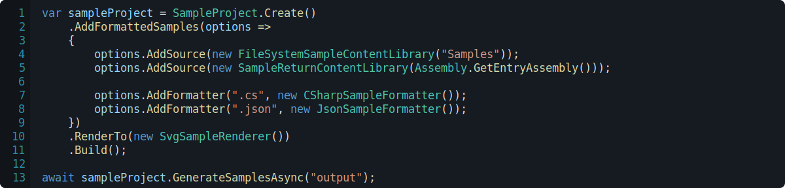
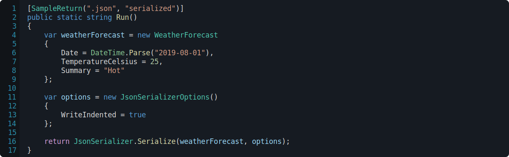
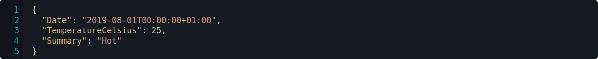
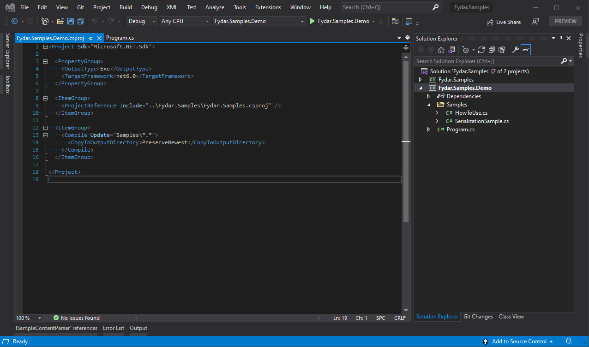
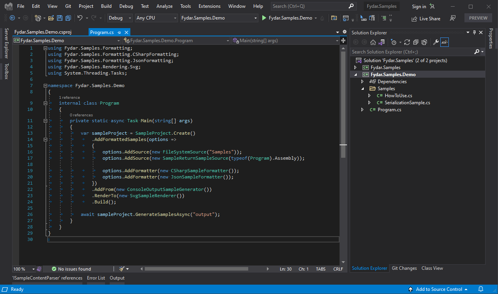

<h1>
📦 Fydar.Samples
</h1>

**Fydar.Samples** is a library for maintaining code samples and generating documentation for **C#**.

  
  <i>A demo of how to use Fydar.Samples to generate samples.</i>

Samples are kept within your project and can be presented via two mechanisms.

- *File System* sampling is used to present code samples.
- *Sample Return* is used to present the result of a method.

  
  <i>A demo of how to use Fydar.Samples to generate samples.</i>

When the application is run, all static methods with the `SampleReturn` attribute are invoked and their results are presented in the output.

  
  <i>The formatted output of the sample.</i>

## 🔧 Installation

Include a reference to the project (NuGet package coming soon) in your solution.

  
  <i>A properly configured .csproj file.</i>

Sample `.cs` files will need to be included in the build output so the syntax highlighter will be able to operate on them.

  
  <i>Solution with samples included in the samples directory.</i>

## ⚖ License

This work is licensed under a [Creative Commons Attribution-NonCommercial 4.0 International License](http://creativecommons.org/licenses/by-nc/4.0/).

